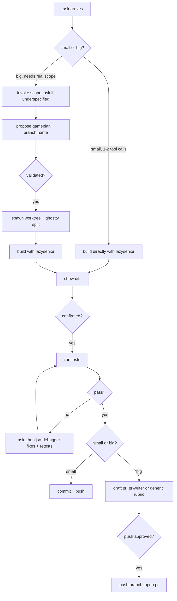

# jso (john sang's orchestrator)

a terminal-native all in one dev-worflow orchestrator agent. give it a ticket and it works
through the proper flow itself, scoping, building, testing,
debugging, and drafting the pr, gated so nothing real happens without your
approval. it's built on a less-is-more design philosophy: minimal diffs,
minimal token spend, while still covering every step a real workflow needs.

## architecture



## install

the repo is both the plugin and its own self-hosted marketplace.

```
claude plugin marketplace add JohnSang16/jso
claude plugin install jso@jso-marketplace
```

restart claude code afterward for the skill and `jso-debugger` subagent to
register.

## update

the plugin cache is version-pinned, editing files here and pushing isn't
enough on its own:

```
claude plugin marketplace update jso-marketplace
claude plugin update jso@jso-marketplace
```

## layout

the repo is both the plugin and its own self-hosted marketplace (see
install above). everything under it falls into four categories.

**plugin manifest**
- `.claude-plugin/plugin.json` - the plugin's identity: name, version,
  description.
- `.claude-plugin/marketplace.json` - makes the repo self-hosting
  (`source: "./"`), so `claude plugin marketplace add JohnSang16/jso`
  works with no separate marketplace repo. version here has to match
  `plugin.json`, or updates silently no-op.

**skills** (loaded via the `Skill` tool, run inline in whichever session
invokes them)
- `skills/jso/SKILL.md` - the orchestrator, `jso:jso`. owns every
  judgment call: size the task, decide whether to invoke `scope`, decide
  whether to propose a worktree, gate every real-blast-radius action
  (spawn, debug-agent invocation, push, merge) behind an explicit yes, run
  the test-detect-and-run pass, drive the tiered diff review
  (high-level/in-depth/minimal + merge/edit/discard).
- `skills/scope/SKILL.md` - `jso:scope`, also usable standalone. runs the
  one-liner / who-feels-this / success-criteria / definition-of-done /
  out-of-scope / decisions-made / biggest-risk / verified-vs-assumed
  interview, one section at a time, pushing back on placeholder answers.
- `skills/jso/pr-templates.md` - reference `SKILL.md` loads once a pr
  actually needs drafting. five base shapes (terse / structured-default /
  root-cause / experimental-spike / feature-with-gaps), how to layer a
  target repo's own pr ceremony on top, and a voice rubric (root cause not
  symptom, numbers over adjectives, name what's not done). used unless a
  personalized pr-drafting agent is installed and preferred instead.

**agent** (loaded via the `Agent` tool, runs in its own subagent context)
- `agents/jso-debugger.md` - `jso-debugger`. takes a failing test's output
  plus the diff that caused it, finds root cause (greps callers of
  whatever it's about to touch, not just the path the ticket names), fixes
  with the minimum correct diff, re-runs the failing test then the full
  relevant suite. never commits/merges/pushes/opens a pr, and only ever
  runs after the orchestrator asks and gets a yes.

**scripts** (`bin/`, bash + applescript, auto-added to `$PATH` on install)
- `register-home.sh` - records whichever ghostty pane has os focus as
  "home" (`~/.jso/home-terminal-id`), so later splits always originate
  from a known pane, not whatever the os happens to be focused on later.
- `new-split.sh <dir> [direction]` - opens a new ghostty split running
  claude code in `<dir>`, split off the registered home pane via ghostty's
  applescript dictionary (macos, ghostty >= 1.3.0 only).
- `spawn-worktree.sh <branch>` - run from inside the target repo. creates
  `git worktree add ~/.jso/worktrees/<repo>/<branch> -b <branch>` off
  current `HEAD`, then calls `new-split.sh` on it.
- `diff-worktree.sh <branch> [base=main]` - prints stat + full diff of
  `<branch>` against `<base>`, for the orchestrator to narrate at whichever
  detail level was asked for.
- `merge-worktree.sh <branch> [base=main]` - checks out `<base>`, merges
  with `--no-ff`. on success, removes the worktree and deletes the branch.
  on conflict, aborts cleanly and leaves the worktree/branch intact rather
  than auto-resolving.
