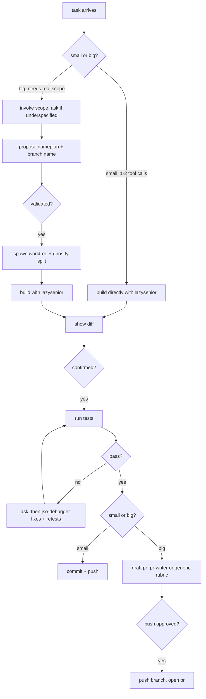

# jso (john sang's orchestrator)

a terminal-native orchestrator agent. give it a ticket and it works
through the actual dev workflow itself, scoping, building, testing,
debugging, and drafting the pr, gated so nothing real happens without your
approval. it's built on a less-is-more design philosophy: minimal diffs,
minimal token spend, while still covering every step a real workflow needs.

## architecture



## install

the repo is both the plugin and its own self-hosted marketplace.

```
claude plugin marketplace add JohnSang16/jso
claude plugin install jso@jso-marketplace
```

restart claude code afterward for the skill and `jso-debugger` subagent to
register.

## update

the plugin cache is version-pinned, editing files here and pushing isn't
enough on its own:

```
claude plugin marketplace update jso-marketplace
claude plugin update jso@jso-marketplace
```

## layout

- `skills/jso/SKILL.md` - the orchestrator's judgment: task sizing, when to
  invoke scope, when to propose a worktree, the test/debug gate, diff
  review, pr drafting.
- `agents/jso-debugger.md` - gated subagent that fixes a failing test,
  never commits/merges/pushes on its own.
- `bin/` - the actual mechanics (`register-home.sh`, `new-split.sh`,
  `spawn-worktree.sh`, `diff-worktree.sh`, `merge-worktree.sh`), auto-added
  to `$PATH` when installed as a plugin.
