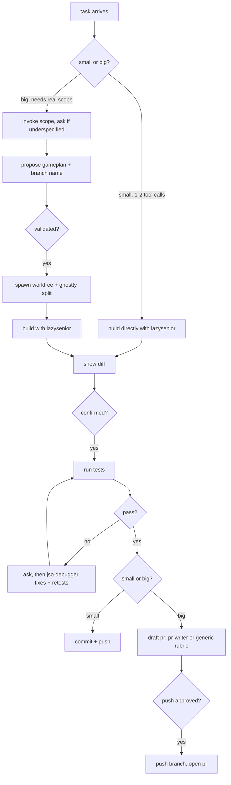

# jso (john sang's orchestrator)

a terminal-native all in one dev-worflow orchestrator agent. give it a ticket and it works
through the proper flow itself, scoping, building, testing,
debugging, and drafting the pr, gated so nothing real happens without your
approval. it's built on a less-is-more design philosophy: minimal diffs,
minimal token spend, while still covering every step a real workflow needs.
the one exception: a task that's genuinely research/investigation-shaped, or
one you explicitly want full effort on, skips the lazy-build step entirely.

## architecture



## install

the repo is both the plugin and its own self-hosted marketplace.

```
claude plugin marketplace add JohnSang16/jso
claude plugin install jso@jso-marketplace
```

restart claude code afterward for the skill and `jso-debugger` subagent to
register.

## update

the plugin cache is version-pinned, editing files here and pushing isn't
enough on its own:

```
claude plugin marketplace update jso-marketplace
claude plugin update jso@jso-marketplace
```

## layout

**skills** (loaded via the `Skill` tool)
- `skills/jso/SKILL.md` - the orchestrator, `jso:jso`. sizes each task,
  decides whether to scope it and whether to spawn a worktree, gates every
  real action behind an explicit yes, runs tests, drives the tiered diff
  review.
- `skills/scope/SKILL.md` - `jso:scope`, also usable standalone. a
  scoping interview (one-liner, success criteria, definition of done,
  risks) that runs before anything substantial gets built.
- `skills/jso/pr-templates.md` - reference the orchestrator loads once a
  pr needs drafting: base shapes by diff type, how to layer a repo's own
  ceremony on top, a voice rubric.

**agent** (loaded via the `Agent` tool)
- `agents/jso-debugger.md` - `jso-debugger`. fixes a failing test root
  cause first, minimal diff, re-runs tests, reports back. never
  commits/merges/pushes, and only runs after an explicit yes.
